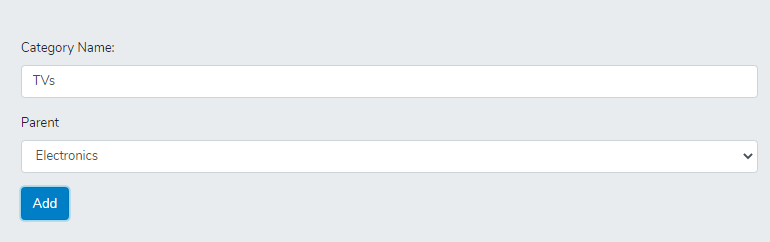

## Installation for testing

- clone the repo ` $ git clone https://github.com/AiMirage/self-join-task`
- create the db and provide credentials to **.env** file.
- install dependencies ` $ composer install`
- install migrations ` $ php artisan migrate`
- add database first seed ` $ php artisan db:seed --class=CategorySeeder`
- start server `$ php artisan serve` and don't forget to start mysql.

### Included Features

- backend api handling GET/POST requests for adding new category using `Laravel`
- simple UI using `React` `React-Bootstrap`
- api AJAX client using `Fetch`

### Screenshots

